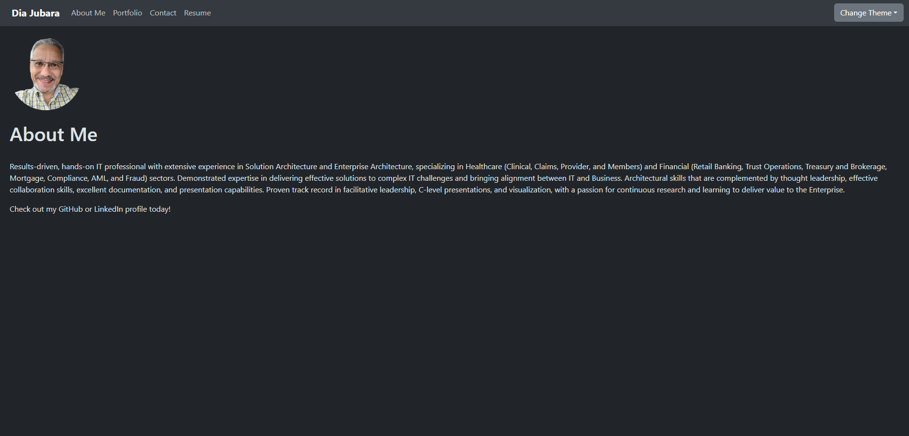
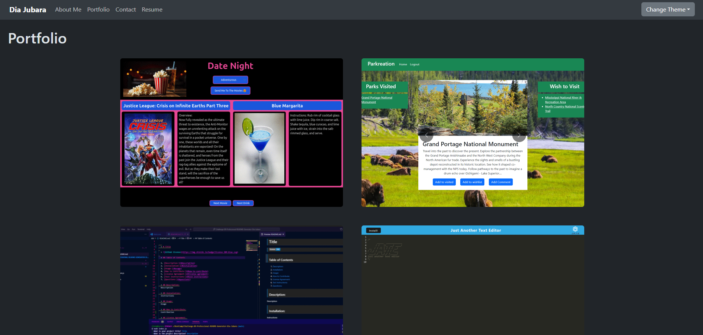
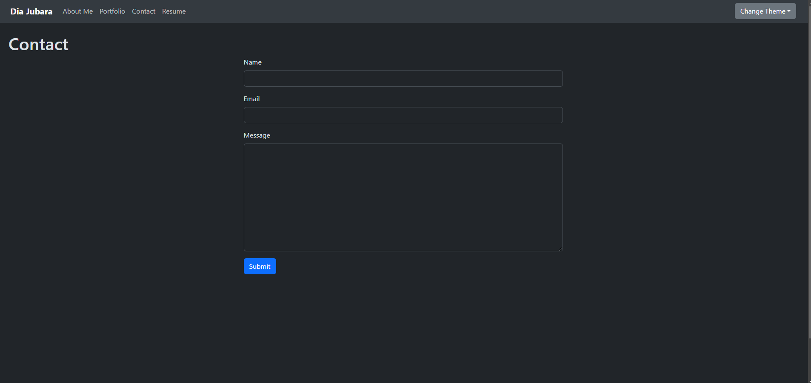
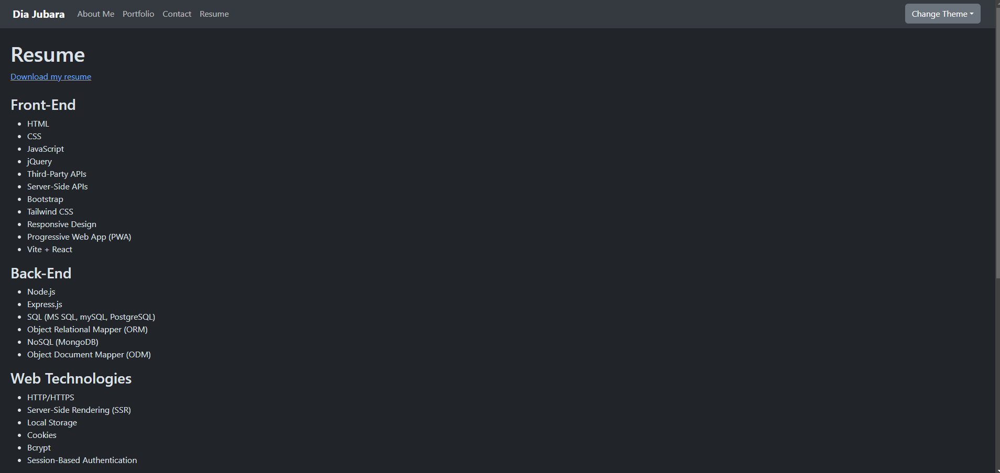
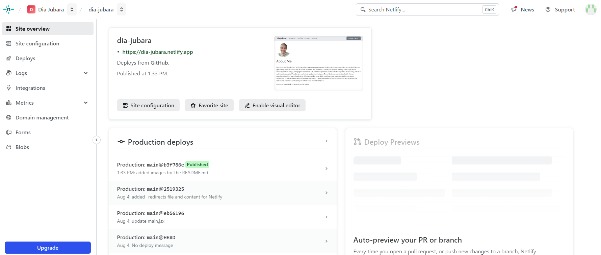

# Challenge-20-React-Portfolio-Dia-Jubara

  > 

  > ## Table of Contents

  1. [Description:](#description)
  2. [Installation:](#installation)
  3. [Usage:](#usage)
  4. [How to Contribute:](#how-to-contribute)
  5. [License Agreement:](#license-agreement)
  6. [Test Instructions:](#test-instructions)
  7. [Questions:](#questions)

  > ## Description

  This is a text editor that runs in the browser. The app will be a single-page application based on PWA architecture. Additionally, it will feature a number of data persistence techniques that serve as redundancy in case one of the options is not supported by the browser. The application will also function offline.

> ## User Story

```md
AS AN employer looking for candidates with experience building single-page applications
I WANT to view a potential employee's deployed React portfolio of work samples
SO THAT I can assess whether they're a good candidate for an open position
```

> ## Acceptance Criteria

```md
GIVEN a single-page application portfolio for a web developer
WHEN I load the portfolio
THEN I am presented with a page containing a header, a section for content, and a footer
WHEN I view the header
THEN I am presented with the developer's name and navigation with titles corresponding to different sections of the portfolio
WHEN I view the navigation titles
THEN I am presented with the titles About Me, Portfolio, Contact, and Resume, and the title corresponding to the current section is highlighted
WHEN I click on a navigation title
THEN the browser URL changes and I am presented with the corresponding section below the navigation and that title is highlighted
WHEN I load the portfolio the first time
THEN the About Me title and section are selected by default
WHEN I am presented with the About Me section
THEN I see a recent photo or avatar of the developer and a short bio about them
WHEN I am presented with the Portfolio section
THEN I see titled images of six of the developer’s applications with links to both the deployed applications and the corresponding GitHub repositories
WHEN I am presented with the Contact section
THEN I see a contact form with fields for a name, an email address, and a message
WHEN I move my cursor out of one of the form fields without entering text
THEN I receive a notification that this field is required
WHEN I enter text into the email address field
THEN I receive a notification if I have entered an invalid email address
WHEN I am presented with the Resume section
THEN I see a link to a downloadable resume and a list of the developer’s proficiencies
WHEN I view the footer
THEN I am presented with text or icon links to the developer’s GitHub and LinkedIn profiles, and their profile on a third platform (Stack Overflow, Twitter)
```

  > ## Application Screenshots









> ## Netlify Image



  > ## Installation

  1. Clone Repository. GitHub repo contains application code
  2. Deploy the application to Render to get a live URL with build scripts

  > ## Usage

  React Portfolio for Dia Jubara
  
  > ## How to Contribute

  Create a pull request or raise an issue.
  
  > ## License Agreement

 Subject to MIT Licensing terms and conditions.

  > ## Test Instructions

  There are no applicable tests
  
  > ## Questions

  If you have any question please visit my GitHub at (<https://github.com/djubara>) or send an email to <djubara@hotmail.com>
